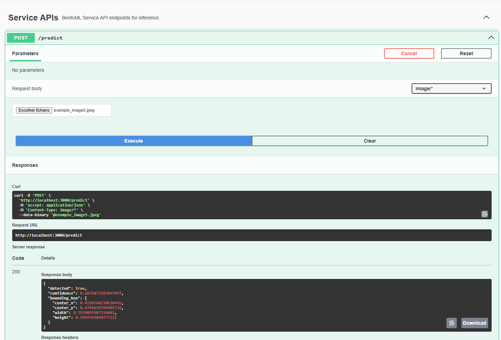
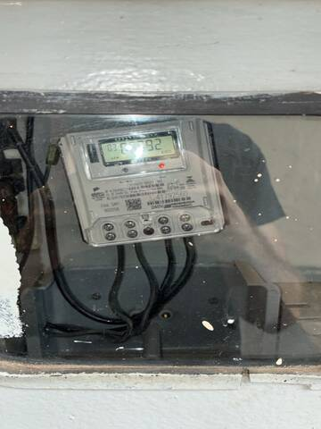
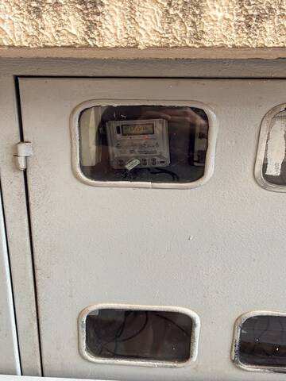
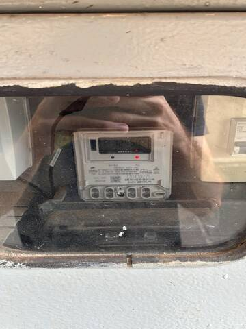
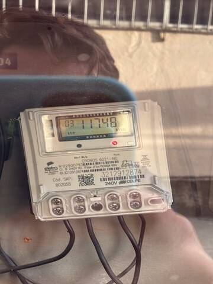

# VoltLens AI

API de inferência para detecção de medidores de energia elétrica em imagens, desenvolvida como parte da disciplina de MLOps.

O projeto transforma um modelo de visão computacional previamente treinado em um serviço HTTP utilizando **BentoML**, permitindo que outras aplicações enviem uma imagem e recebam como resposta a detecção do medidor, sua localização na imagem e a confiança da predição.

## Objetivo

O objetivo é disponibilizar o modelo de detecção de medidores como um serviço consumível por outras aplicações, retirando a inferência do ambiente de desenvolvimento e tornando-a acessível por meio de uma API HTTP.

O fluxo da aplicação é:

```text
Imagem
   ↓
API BentoML
   ↓
Pré-processamento
   ↓
MeterNetwork
   ↓
Inferência
   ↓
JSON
```

O serviço recebe uma imagem de um medidor através do endpoint `/predict` e retorna:

* indicação se um medidor foi detectado;
* confiança da detecção;
* bounding box normalizada do objeto detectado.

---

# Modelo utilizado

O modelo utilizado é uma rede neural convolucional desenvolvida especificamente para a detecção de medidores em imagens.

A arquitetura `MeterNetwork` foi implementada utilizando **PyTorch** e é composta por camadas convolucionais, funções de ativação ReLU e operações de Max Pooling, finalizando em uma camada convolucional responsável por gerar as informações da detecção.

## Entrada

A imagem recebida pela API passa pelo seguinte pré-processamento:

1. conversão para RGB;
2. redimensionamento para `360 × 480`;
3. conversão para escala de cinza;
4. conversão para tensor;
5. envio para o modelo.

## Saída

O modelo produz um grid de predições contendo:

* posição `x`;
* posição `y`;
* largura;
* altura;
* confiança/objectness.

A melhor predição é selecionada e convertida para coordenadas normalizadas.

## Treinamento

O modelo foi desenvolvido e treinado anteriormente como parte do projeto de visão computacional da disciplina, com o objetivo de detectar automaticamente a região do medidor em fotografias.

O treinamento utilizou imagens rotuladas com bounding boxes da classe `Medidor`.

A arquitetura `MeterNetwork` foi implementada em PyTorch e treinada especificamente para essa tarefa.

O checkpoint utilizado pela API é:

```text
model/meter_detector.pt
```

O checkpoint contém os pesos treinados da rede e as informações necessárias para sua utilização durante a inferência.

O serviço não realiza treinamento. Sua responsabilidade é carregar o modelo e disponibilizar a inferência por meio de uma API.

## Características do modelo

* Framework: PyTorch
* Tipo: Rede Neural Convolucional
* Tarefa: detecção/localização de medidor
* Classe detectada: `Medidor`
* Entrada: imagem
* Tamanho utilizado pelo modelo: `360 × 480`
* Saída: bounding box + confiança

---

# Limitações atuais

O modelo atualmente realiza **detecção do medidor**.

Ele ainda não realiza:

* OCR do número do medidor;
* leitura do consumo;
* identificação automática de todas as funções do equipamento;
* comparação entre a leitura da imagem e uma leitura de referência;
* classificação de divergência.

Essas funcionalidades fazem parte de possíveis evoluções do projeto.

Além disso, a qualidade da detecção pode variar de acordo com fatores como:

* iluminação;
* posição da câmera;
* distância;
* enquadramento;
* oclusões;
* qualidade da imagem;
* características do medidor não representadas adequadamente no conjunto de treinamento.

Por esse motivo, o modelo não deve ser considerado um sistema completo de leitura automática de medidores. Nesta versão, seu objetivo é exclusivamente localizar o medidor na imagem.

---

# Arquitetura do serviço

O serviço foi desenvolvido utilizando **BentoML**, com o modelo executado localmente e disponibilizado através de uma API HTTP.

A estrutura principal é:

```text
voltlensAI/
├── model/
│   └── meter_detector.pt
├── images/
│   ├── exemple_image1.jpeg
│   ├── exemple_image2.jpeg
│   ├── exemple_image3.jpeg
│   ├── exemple_image4.jpeg
│   └── exemple_image5.jpeg
├── assets/
│   └── swagger.png
├── src/
│   └── voltlensai/
│       ├── __init__.py
│       ├── model.py
│       ├── inference.py
│       └── service.py
├── pyproject.toml
├── uv.lock
├── .python-version
├── .gitignore
├── LICENSE
└── README.md
```

## Responsabilidade dos arquivos

**`model.py`**

Define a arquitetura da rede neural `MeterNetwork`.

**`inference.py`**

Responsável pelo carregamento do checkpoint, pré-processamento da imagem, execução da inferência e interpretação da saída do modelo.

**`service.py`**

Expõe o modelo como uma API utilizando BentoML.

**`model/meter_detector.pt`**

Checkpoint contendo os pesos treinados do modelo.

**`images/`**

Contém as imagens públicas utilizadas para demonstração e testes da API.

**`assets/swagger.png`**

Captura da interface Swagger/OpenAPI disponibilizada pelo BentoML durante a execução local do serviço.

**`pyproject.toml`**

Define as dependências e configurações do projeto.

**`uv.lock`**

Registra as versões resolvidas das dependências utilizadas, permitindo uma instalação reproduzível.

---

# Execução

## Requisitos

Para executar o projeto, são necessários:

* Git;
* Python na versão especificada em `.python-version`;
* `uv`.

O projeto foi desenvolvido e testado em ambiente Windows.

## Versão do Python

A versão utilizada no projeto está registrada no arquivo:

```text
.python-version
```

O `pyproject.toml` também define a versão mínima compatível do Python.

---

## 1. Clonar o projeto

```bash
git clone https://github.com/FelipeSalustiano/voltlensAI.git
cd voltlensAI
```

---

## 2. Instalar as dependências

O projeto utiliza `uv` para gerenciamento do ambiente e das dependências.

Execute:

```bash
uv sync
```

O arquivo `uv.lock` está versionado no repositório para garantir uma instalação reproduzível.

A instalação pode levar alguns minutos dependendo da conexão e da máquina, principalmente devido às dependências de PyTorch e torchvision.

---

## 3. Iniciar o serviço

Execute:

```bash
uv run bentoml serve src/voltlensai/service.py:MeterDetectionService
```

Após a inicialização, o serviço estará disponível em:

```text
http://localhost:3000
```

A API permanece executando enquanto o processo estiver ativo.

---

# Utilização da API

## Swagger / OpenAPI

O BentoML disponibiliza uma interface Swagger/OpenAPI para interação com o serviço.

Com o servidor em execução, acesse:

```text
http://localhost:3000
```

Localize o endpoint:

```text
POST /predict
```

Clique em **Try it out**, selecione uma imagem JPEG e execute a requisição.

O serviço processará a imagem e retornará o resultado da detecção.

### Interface Swagger

Abaixo está uma captura da interface disponibilizada pelo BentoML durante a execução local do serviço:



---

# Testando via cURL

Também é possível consumir a API diretamente através de uma requisição HTTP.

Exemplo:

```powershell
curl.exe -X POST http://localhost:3000/predict `
  -H "Content-Type: image/jpeg" `
  --data-binary "@images/exemple_image1.jpeg"
```

O comando envia a imagem diretamente no corpo da requisição.

---

# Contrato da API

## Endpoint

```text
POST /predict
```

## Entrada

A API recebe uma imagem diretamente no corpo da requisição.

Exemplo:

```text
Content-Type: image/jpeg
```

Exemplo de chamada:

```powershell
curl.exe -X POST http://localhost:3000/predict `
  -H "Content-Type: image/jpeg" `
  --data-binary "@images/exemple_image1.jpeg"
```

## Saída

Quando um medidor é detectado, a API retorna um objeto JSON:

```json
{
  "detected": true,
  "confidence": 0.67,
  "bounding_box": {
    "center_x": 0.81,
    "center_y": 0.22,
    "width": 0.75,
    "height": 0.57
  }
}
```

Quando nenhum objeto é detectado acima do limiar utilizado pelo serviço:

```json
{
  "detected": false,
  "confidence": 0.0,
  "bounding_box": null
}
```

## Campos da resposta

| Campo        | Descrição                           |
| ------------ | ----------------------------------- |
| `detected`   | Indica se um medidor foi detectado  |
| `confidence` | Confiança da detecção               |
| `center_x`   | Coordenada X central normalizada    |
| `center_y`   | Coordenada Y central normalizada    |
| `width`      | Largura da bounding box normalizada |
| `height`     | Altura da bounding box normalizada  |

As coordenadas da bounding box são normalizadas entre `0` e `1`, permitindo representar a localização do objeto de forma relativa às dimensões da imagem.

---

# Exemplo de resposta real

Em um teste realizado localmente, a API retornou:

```json
{
  "detected": true,
  "confidence": 0.6720746159553528,
  "bounding_box": {
    "center_x": 0.8110498487949371,
    "center_y": 0.22479363481203715,
    "width": 0.7532642483711243,
    "height": 0.5677396059036255
  }
}
```

Esse resultado demonstra que o serviço conseguiu carregar o checkpoint, receber uma imagem, executar o pré-processamento, realizar a inferência e retornar uma resposta JSON através do endpoint HTTP.

---

# Demonstração

O repositório disponibiliza cinco imagens públicas para demonstração e teste da API.

## Imagem 1



## Imagem 2



## Imagem 3


## Imagem 4



## Imagem 5



Essas imagens podem ser utilizadas diretamente nos exemplos de requisição apresentados neste README.

As imagens incluídas no repositório são destinadas exclusivamente à demonstração do serviço e não devem conter dados de clientes ou informações operacionais privadas.

---

# Possíveis evoluções

Como próximos passos, o serviço pode evoluir para um pipeline mais completo de leitura de medidores:

```text
Imagem
   ↓
Detecção do medidor
   ↓
Recorte da região
   ↓
OCR
   ↓
Leitura dos valores
   ↓
Validação com dados de referência
   ↓
Classificação
```

Entre as possíveis melhorias estão:

* implementação de OCR;
* identificação do número do medidor;
* leitura do consumo;
* tratamento de diferentes condições de iluminação;
* aumento e diversificação do dataset;
* avaliação com métricas específicas de detecção;
* ajuste do limiar de confiança;
* monitoramento das inferências;
* versionamento dos modelos;
* criação de testes automatizados;
* acompanhamento de métricas de desempenho do modelo em produção.

---

# Uso de Inteligência Artificial

Ferramentas de Inteligência Artificial generativa foram utilizadas como apoio durante o desenvolvimento.

A IA foi utilizada principalmente para:

* auxílio na estruturação do serviço;
* esclarecimento de conceitos e APIs;
* revisão de código;
* identificação e correção de problemas de integração;
* apoio na elaboração da documentação.

As sugestões geradas foram analisadas e adaptadas ao projeto. Todo o código utilizado no projeto foi revisado e validado durante a execução local do serviço.

A utilização de IA não substituiu a compreensão e validação do funcionamento do código.

---

# Licença

Este projeto está disponibilizado sob a licença MIT.

Consulte o arquivo [`LICENSE`](LICENSE) para mais informações.
